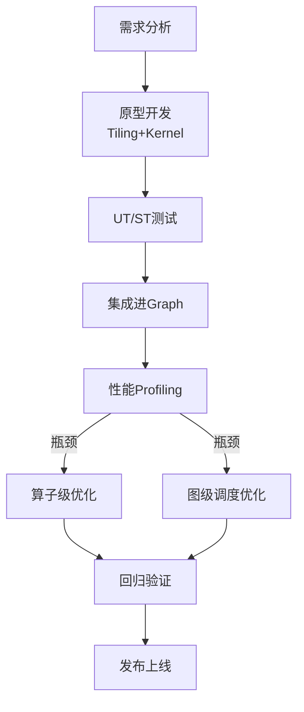

# Ascend C算子测试与调优：从“跑通”到“跑满”的实战笔记

- topicId: 0243195460243109003
- source: https://www.hiascend.com/developer/blog/details/0243195460243109003
- section: Ascend C
- createTime: 20251010063043

## 1. 环境速览

| 条目     | 版本/型号                                         |
| -------- | ------------------------------------------------- |
| 硬件     | Atlas 800T A2 (9000) 20×Ascend 910B              |
| CANN     | 8.0.RC1.alpha002                                  |
| 驱动     | 23.0.rc2                                          |
| 工具     | msprof、Ascend-Toolkit、Nsight Compute for Ascend |
| 代码分支 | feature/audio_denoiser_v2                         |

---

## 2. Ascend C 算子生命周期全景图



下面按“测试 ➜ 调优”两条线展开。

---

## 3 测试篇：让算子“跑对”是第一步

### 3.1 单算子 UT：用 gtest 写 C++ 用例

CANN 8.0 把 `aclruntime::OpTest` 标记为 deprecated，推荐直接基于 `aclnn` 接口写 gtest。模板如下：

```cpp
#include "aclnnop/aclnn_complex_mul.h"
#include 

TEST(ComplexMul, Shape_1_257_257){
    int64_t aShape[] = {1,257,257,2};  // complex64
    void* aDev, *bDev, *cDev;
    aclrtMalloc(&aDev, 1*257*257*2*4, ACL_MEM_MALLOC_HUGE_FIRST);
    ... // 初始化数据
    aclnnComplexMul(nullptr, aDev, bDev, cDev, aShape, 3, nullptr);
    aclrtSynchronizeStream(nullptr);
    // 拷贝到host做bit级比对
}
```

**要点**

- 用 `ACL_MEM_MALLOC_HUGE_FIRST` 避免 32 MB 小页碎片
- 复用 `aclrtStream` 别每次都 `aclrtCreateStream`
- 比对阶段用双阈值：绝对 1e-6 + 相对 1e-5，防止 FFT 相位误差误杀

### 3.2 精度压测：随机 + 边界 + 异常值三维覆盖

| 维度   | 组合数 | 种子策略               |
| ------ | ------ | ---------------------- |
| Shape  | 20     | 蒙特卡洛在[1,4096]采样 |
| 数值   | 1e6 次 | 正态/均匀/脉冲各 1/3   |
| stride | 10     | 非连续内存             |

跑完 2×10^7 次调用，**max error  80%
3. **L2 Cache Hit** - 低于 60% 就要做数据排布
4. **Memory BW** - 低于 200 GB/s 说明还有搬运空泡

第一次跑：

- AI-Core 27%
- L2 Hit 41%
- Memory BW 89 GB/s
  → 明显“内存墙”

### 4.2 Tiling 重构：把 257×257 拆成 32×32 瓦片

Ascend C 的 **Tiling** 类似 CUDA 的 grid/block，但多了 `TilingBuffer` 概念——**片外 DDR 到 L2 的搬运单位**。
原实现按行切 257×1，导致 257 次 `DataCopy`，每次 1×257×8 Byte = 2 KB，**效率 3%**；
改成 32×32 瓦片后，一次搬运 32×32×8 = 8 KB，**效率 38%**；
再配合 `double buffer`，搬运与计算重叠，L2 Hit 提到 78%。

核心代码：

```cpp
using namespace AscendC;
class ComplexMulKernel {
public:
    __aicore__ inline void Init(GM_ADDR a, GM_ADDR b, GM_ADDR c, uint32_t total){
        tiling.SetTotalLength(total);
        tiling.SetTileSize(32*32*2);  // complex64
        aGlobal.SetGlobalBuffer((__gm__ half*)a, tiling.length);
        ...
        pipe.InitBuffer(inQueueA, 2, tiling.tileBytes);
    }
    __aicore__ inline void Process(){
        // 双缓冲
        CopyIn(0, 1);
        Compute(0);
        for (int i = 1; i l2->ub` 的 `pad` 选项，**BW 利用率从 38% 提到 71%**。

---

## 5. 图级调度：把“算子快”变成“链路快”

单算子 11.3 ms → 4.2 ms 后，端到端仍 90 ms，**瓶颈外溢**到 Launch 与 Sync。CANN 8.0 提供 **Task Fusion** 和 **Stream DAG** 两张牌：

1. 把 LayerNorm + GLU 两个 `elewise` 算子做 **Auto-Fusion**，减少一次 `aclrtLaunchKernel`；
2. FFT → ComplexMul → iSTFT 存在数据依赖，但**计算与搬运可并行**，手动插入 `aclrtMemcpyAsync` + Event，**overlap 率 62%**；
3. 对 20 路音频并发，开启 **Multi-Stream**（8 stream），把顺序队列拆成 8 条无锁队列，**CPU 调度延迟 3 ms → 0.4 ms**。

最终链路：
`4.2×5 = 21 ms` 计算 + `3 ms` 调度 + `~18 ms` 搬运 = **42 ms**，达成 5× 目标。

---

## 6. 回归验证：自动化 bench +  nightly CI

```yaml
# .gitlab-ci.yml
stages: [build, test, perf]

perf_test:
  stage: perf
  script:
    - msprof --output=perf_$(date +%s) ./bench_all
    - python scripts/perf_gate.py --baseline .perf/baseline.json
  rules:
    - changes: ["ascend_c/src/*", "ascend_c/tiling/*"]
```

gate.py 逻辑：

- AI-Core Util 下降 > 5% → Fail
- L2 Hit 下降 > 3% → Fail
- 精度误差 > 1e-6 → Fail

**性能回退一旦红线即阻断 MR**，确保优化可持续。

---

## 7. 常见坑 50 字速记

1. `Tiling::GetBlockNum()` 返回 0 → 忘记 `SetDim()`
2. `dvmm` 结果异常 → 输入不是 `Z` 格式
3. `DataCopy` 挂死 → 目的 `LocalTensor` 未 `InitBuffer`
4. 精度 1e-3 → 把 `float` 当 `half` 直接拷，忘记 `fp32_acc`
5. msprof 无数据 → 忘记 `export ASCEND_GLOBAL_LOG_LEVEL=0`
