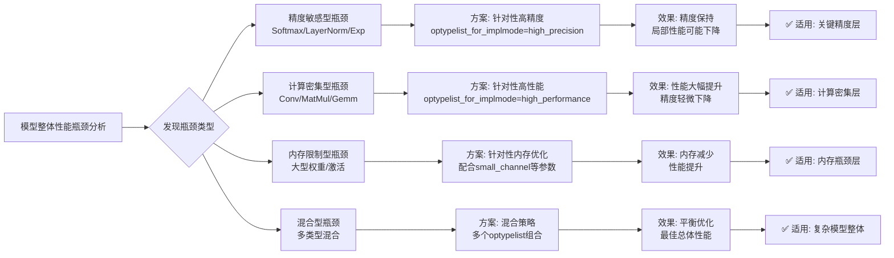

# 使用--optypelist_for_implmode优化算子性能

- topicId: 0296205142385789826
- source: https://www.hiascend.com/developer/blog/details/0296205142385789826
- section: Ascend C
- createTime: 20260130075946

# **昇腾ATC optypelist_for_implmode 精准优化指南：算子级性能调优**

## **一、核心概念：为什么要用 optypelist_for_implmode？**



---

## **二、基础语法与参数详解**

### **2.1 基础语法格式**

```bash
# 基础语法
atc --model=model.onnx \
    --op_select_implmode=模式 \              # 主模式
    --optypelist_for_implmode="算子1,算子2,..." \  # 目标算子列表
    --output=optimized_model

# 实际示例
atc --model=resnet50.onnx \
    --op_select_implmode=high_performance \      # 主模式：高性能
    --optypelist_for_implmode="Conv,Add,Relu" \  # 对这些算子应用高性能
    --output=resnet50_targeted
```

### **2.2 参数详解**


| **参数**                  | **类型**   | **格式** | **说明**                                   | **示例**                        |
| ------------------------- | ---------- | -------- | ------------------------------------------ | ------------------------------- |
| `op_select_implmode`      | 字符串     | 单个模式 | 主实现模式                                 | `high_performance`              |
| `optypelist_for_implmode` | 字符串列表 | 逗号分隔 | 应用主模式的算子列表                       | `"Conv,Add,Relu"`               |
| 组合效果                  | -          | -        | 列表中算子使用主模式，其他算子使用默认模式 | Conv使用高性能，Softmax使用默认 |

### **2.3 完整参数交互**

```bash
# 完整示例：混合精度+针对性优化
atc --model=model.onnx \
    --op_select_implmode=high_performance \          # 主模式
    --optypelist_for_implmode="Conv,MatMul,Add,Mul" \ # 高性能算子
    --precision_mode=allow_mix_precision \           # 混合精度
    --enable_small_channel=1 \                       # 内存优化
    --fusion_switch_file=fusion.cfg \                # 融合配置
    --output=model_fully_optimized
```

---

## **三、算子分类与优化策略**

### **3.1 算子性能特性分类表**


| **算子类型**               | **计算密度** | **内存需求** | **精度敏感度** | **推荐模式**       | **优化收益** |
| -------------------------- | ------------ | ------------ | -------------- | ------------------ | ------------ |
| **Conv/ConvTranspose**     | 极高         | 高           | 中低           | `high_performance` | 30-50%加速   |
| **MatMul/Gemm**            | 极高         | 高           | 中             | `high_performance` | 40-60%加速   |
| **Add/Sub/Mul**            | 中           | 低           | 低             | `high_performance` | 10-20%加速   |
| **Relu/LeakyRelu**         | 低           | 低           | 低             | `high_performance` | 5-10%加速    |
| **Softmax/LogSoftmax**     | 中           | 中           | 极高           | `high_precision`   | 精度保护     |
| **LayerNorm/InstanceNorm** | 中           | 中           | 高             | `high_precision`   | 精度保护     |
| **Exp/Log/Pow**            | 高           | 中           | 极高           | `high_precision`   | 数值稳定     |
| **Sin/Cos/Tan**            | 高           | 中           | 高             | `high_precision`   | 精度保护     |
| **Sigmoid/Tanh**           | 中           | 中           | 中             | `high_performance` | 20-30%加速   |
| **Reshape/Transpose**      | 低           | 低           | 低             | `default`          | 优化有限     |
| **Concat/Split**           | 低           | 中           | 低             | `default`          | 优化有限     |

### **3.2 常用算子列表生成器**

```python
# generate_optype_lists.py
import onnx
import json

def generate_optimization_lists(model_path):
    """自动分析模型并生成优化算子列表"""
  
    model = onnx.load(model_path)
  
    # 算子统计
    op_counts = {}
    for node in model.graph.node:
        op_type = node.op_type
        op_counts[op_type] = op_counts.get(op_type, 0) + 1
  
    # 分类建议
    recommendations = {
        'high_performance_ops': [],
        'high_precision_ops': [],
        'default_ops': []
    }
  
    # 分类规则
    performance_ops = ['Conv', 'ConvTranspose', 'MatMul', 'Gemm', 
                       'Add', 'Mul', 'Relu', 'LeakyRelu', 'Sigmoid', 'Tanh']
  
    precision_ops = ['Softmax', 'LogSoftmax', 'LayerNorm', 'InstanceNorm',
                     'Exp', 'Log', 'Pow', 'Sin', 'Cos', 'Tan', 'Sqrt', 'Reciprocal']
  
    for op_type, count in op_counts.items():
        if op_type in performance_ops and count > 0:
            recommendations['high_performance_ops'].append({
                'op_type': op_type,
                'count': count,
                'reason': '计算密集型，从高性能模式获益大'
            })
        elif op_type in precision_ops and count > 0:
            recommendations['high_precision_ops'].append({
                'op_type': op_type,
                'count': count,
                'reason': '精度敏感型，需要高精度保护'
            })
        else:
            recommendations['default_ops'].append({
                'op_type': op_type,
                'count': count,
                'reason': '其他类型，使用默认模式'
            })
  
    # 生成ATC命令片段
    atc_snippet = f"""# 自动生成的优化配置
# 模型: {model_path}
# 总算子数: {sum(op_counts.values())}

# 高性能算子列表（建议）
high_perf_ops = "{','.join([op['op_type'] for op in recommendations['high_performance_ops']])}"

# 高精度算子列表（建议）  
high_prec_ops = "{','.join([op['op_type'] for op in recommendations['high_precision_ops']])}"

# ATC命令示例
atc --model={model_path} \\
    --op_select_implmode=high_performance \\
    --optypelist_for_implmode="$high_perf_ops" \\
    --output=model_optimized
"""
  
    return {
        'statistics': op_counts,
        'recommendations': recommendations,
        'atc_snippet': atc_snippet
    }

# 使用示例
if __name__ == "__main__":
    analysis = generate_optimization_lists("resnet50.onnx")
  
    print("算子分析报告")
    print("="*60)
  
    # 打印统计
    print("\n算子统计:")
    for op_type, count in sorted(analysis['statistics'].items(), key=lambda x: x[1], reverse=True):
        print(f"  {op_type:15}: {count:3d} 个")
  
    # 打印建议
    print("\n优化建议:")
    print("-"*60)
  
    print("1. 高性能模式推荐算子:")
    for rec in analysis['recommendations']['high_performance_ops']:
        print(f"   {rec['op_type']:15} ({rec['count']:2d}个): {rec['reason']}")
  
    print("\n2. 高精度模式推荐算子:")
    for rec in analysis['recommendations']['high_precision_ops']:
        print(f"   {rec['op_type']:15} ({rec['count']:2d}个): {rec['reason']}")
  
    print("\n3. ATC配置片段:")
    print(analysis['atc_snippet'])
  
    # 保存到文件
    with open('optimization_recommendations.json', 'w') as f:
        json.dump(analysis, f, indent=2)
  
    print(f"\n详细报告已保存: optimization_recommendations.json")
```

---

## **四、实战优化策略**

### **4.1 策略一：计算密集型优化**

```bash
# 计算密集型算子优化（CNN典型）
atc --model=resnet50.onnx \
    --op_select_implmode=high_performance \
    --optypelist_for_implmode="Conv,Add,Mul,Relu,MaxPool,AveragePool" \
    --enable_fast_math \                    # 快速数学
    --enable_conv_algorithm_search \        # 卷积算法搜索
    --conv_algorithm_preference="performance" \
    --output=resnet50_compute_optimized

# 计算密集型算子优化（Transformer典型）
atc --model=bert.onnx \
    --op_select_implmode=high_performance \
    --optypelist_for_implmode="MatMul,Add,Mul,Gelu" \
    --enable_matrix_multiply_optimization \  # 矩阵乘优化
    --matmul_algorithm="tiling" \            # 分块算法
    --output=transformer_compute_optimized
```

### **4.2 策略二：精度敏感型保护**

```bash
# 精度敏感算子保护
atc --model=model.onnx \
    --op_select_implmode=high_precision \
    --optypelist_for_implmode="Softmax,LayerNorm,Exp,Log,Sqrt" \
    --precision_mode=allow_mix_precision \
    --output=model_precision_protected

# 分层保护策略
cat > precision_protection.cfg << 'EOF'
[precision_protection]
strategy = "layered"

[high_precision_layers]
layers = "attention.softmax, mlp.gelu, norm.*"
mode = "high_precision"
strictness = "high"

[medium_precision_layers]  
layers = "conv.*, linear.*"
mode = "default"
strictness = "medium"

[performance_layers]
layers = "relu.*, add.*, mul.*"
mode = "high_performance"
strictness = "low"
EOF

atc --model=model.onnx \
    --precision_protection_config=precision_protection.cfg \
    --output=model_layered_protected
```

### **4.3 策略三：混合优化（推荐）**

```bash
# 方案1：高性能为主，保护精度敏感层
HIGH_PERF_OPS="Conv,ConvTranspose,MatMul,Gemm,Add,Mul,Relu,Sigmoid,Tanh"
HIGH_PREC_OPS="Softmax,LayerNorm,Exp,Log,Pow"

atc --model=model.onnx \
    --op_select_implmode=high_performance \
    --optypelist_for_implmode="$HIGH_PERF_OPS" \
    --precision_mode=allow_mix_precision \
    --keep_fp32_ops="$HIGH_PREC_OPS" \      # 精度敏感层保持FP32
    --output=model_mixed_optimized

# 方案2：使用多个ATC步骤（复杂但精细）
# 步骤1：提取精度敏感层
python3 extract_sensitive_layers.py --model model.onnx --output sensitive_layers.txt

# 步骤2：高性能优化非敏感层
NON_SENSITIVE_OPS=$(python3 get_non_sensitive_ops.py --model model.onnx --sensitive sensitive_layers.txt)

atc --model=model.onnx \
    --op_select_implmode=high_performance \
    --optypelist_for_implmode="$NON_SENSITIVE_OPS" \
    --output=model_stage1

# 步骤3：整体转换（保留第一阶段优化）
atc --model=model.onnx \
    --op_select_implmode=default \
    --load_optimization="model_stage1.opt" \  # 假设有优化缓存
    --output=model_final
```

### **4.4 策略四：基于硬件特性的优化**

```bash
# 根据芯片类型优化
SOC_VERSION="Ascend310"

case $SOC_VERSION in
    "Ascend310")
        # 310芯片：保守优化，内存有限
        PERF_OPS="Conv,MatMul"  # 只优化最关键算子
        PREC_OPS="Softmax,LayerNorm,Exp"
        EXTRA_FLAGS="--enable_small_channel=1 --buffer_optimize=off_optimize"
        ;;
    "Ascend310P")
        # 310P芯片：平衡优化，有更多资源
        PERF_OPS="Conv,ConvTranspose,MatMul,Gemm,Add,Mul,Relu"
        PREC_OPS="Softmax,LayerNorm,Exp,Log,Pow"
        EXTRA_FLAGS="--enable_multi_precision --enable_vectorization"
        ;;
    "Ascend710")
        # 710芯片：激进优化，性能强大
        PERF_OPS="Conv,ConvTranspose,MatMul,Gemm,Add,Mul,Relu,Sigmoid,Tanh,MaxPool"
        PREC_OPS="Softmax,LayerNorm"
        EXTRA_FLAGS="--enable_bf16 --enable_tensor_core"
        ;;
    *)
        PERF_OPS="Conv,MatMul"
        PREC_OPS="Softmax"
        EXTRA_FLAGS=""
        ;;
esac

atc --model=model.onnx \
    --soc_version=$SOC_VERSION \
    --op_select_implmode=high_performance \
    --optypelist_for_implmode="$PERF_OPS" \
    --precision_mode=allow_mix_precision \
    --keep_fp32_ops="$PREC_OPS" \
    $EXTRA_FLAGS \
    --output=model_${SOC_VERSION}_optimized
```

---

## **五、性能分析与调优工具**

### **5.1 算子性能分析工具**

```python
# operator_performance_analyzer.py
import json
import numpy as np
from collections import defaultdict

class OperatorPerformanceProfiler:
    def __init__(self):
        self.operator_stats = defaultdict(lambda: {
            'count': 0,
            'total_time': 0.0,
            'avg_time': 0.0,
            'percentage': 0.0,
            'suggestions': []
        })
  
    def parse_benchmark_results(self, benchmark_file):
        """解析基准测试结果"""
        with open(benchmark_file, 'r') as f:
            data = json.load(f)
    
        # 假设benchmark输出包含算子级性能数据
        if 'operator_performance' in data:
            for op_data in data['operator_performance']:
                op_type = op_data['op_type']
                exec_time = op_data['execution_time_ms']
            
                self.operator_stats[op_type]['count'] += 1
                self.operator_stats[op_type]['total_time'] += exec_time
    
        # 计算平均值和百分比
        total_time = sum(stats['total_time'] for stats in self.operator_stats.values())
    
        for op_type, stats in self.operator_stats.items():
            if stats['count'] > 0:
                stats['avg_time'] = stats['total_time'] / stats['count']
            stats['percentage'] = (stats['total_time'] / total_time) * 100
    
        return self.operator_stats
  
    def generate_optimization_suggestions(self, threshold_ms=1.0, threshold_percent=5.0):
        """生成优化建议"""
    
        suggestions = []
    
        for op_type, stats in self.operator_stats.items():
            if stats['avg_time'] > threshold_ms or stats['percentage'] > threshold_percent:
                suggestion = {
                    'operator': op_type,
                    'avg_time_ms': stats['avg_time'],
                    'percentage': stats['percentage'],
                    'optimizations': []
                }
            
                # 基于算子类型给出建议
                if op_type in ['Conv', 'ConvTranspose', 'MatMul', 'Gemm']:
                    suggestion['optimizations'].append(
                        "添加到optypelist_for_implmode使用high_performance模式"
                    )
                    suggestion['optimizations'].append(
                        "启用卷积/矩阵乘算法搜索: --enable_conv_algorithm_search"
                    )
                
                elif op_type in ['Softmax', 'LayerNorm', 'Exp', 'Log']:
                    suggestion['optimizations'].append(
                        "添加到高精度保护列表，使用high_precision模式"
                    )
                    suggestion['optimizations'].append(
                        "保持为FP32精度: --keep_fp32_ops"
                    )
                
                elif op_type in ['Add', 'Mul', 'Relu']:
                    suggestion['optimizations'].append(
                        "使用高性能模式，但收益可能有限"
                    )
                
                else:
                    suggestion['optimizations'].append(
                        "检查是否有融合优化机会"
                    )
            
                suggestions.append(suggestion)
    
        return suggestions
  
    def create_atc_configuration(self, suggestions, output_file="atc_optimized.sh"):
        """基于分析创建ATC配置"""
    
        # 分类算子
        high_perf_ops = []
        high_prec_ops = []
    
        for suggestion in suggestions:
            op_type = suggestion['operator']
        
            if op_type in ['Conv', 'ConvTranspose', 'MatMul', 'Gemm', 'Add', 'Mul', 'Relu']:
                high_perf_ops.append(op_type)
            elif op_type in ['Softmax', 'LayerNorm', 'Exp', 'Log', 'Pow', 'Sqrt']:
                high_prec_ops.append(op_type)
    
        # 去重
        high_perf_ops = list(set(high_perf_ops))
        high_prec_ops = list(set(high_prec_ops))
    
        # 生成ATC命令
        atc_command = f"""#!/bin/bash
# 自动生成的优化配置
# 基于性能分析结果

HIGH_PERF_OPS="{','.join(high_perf_ops)}"
HIGH_PREC_OPS="{','.join(high_prec_ops)}"

echo "开始优化转换..."
echo "高性能算子: $HIGH_PERF_OPS"
echo "高精度保护: $HIGH_PREC_OPS"

atc --model=model.onnx \\
    --framework=5 \\
    --output=model_optimized \\
    --soc_version=Ascend310 \\
    --op_select_implmode=high_performance \\
    --optypelist_for_implmode="$HIGH_PERF_OPS" \\
    --precision_mode=allow_mix_precision \\
    --keep_fp32_ops="$HIGH_PREC_OPS" \\
    --enable_small_channel=1 \\
    --log=info

echo "转换完成"
"""
    
        # 保存到文件
        with open(output_file, 'w') as f:
            f.write(atc_command)
    
        # 添加执行权限
        import os
        os.chmod(output_file, 0o755)
    
        print(f"ATC配置已生成: {output_file}")
    
        return {
            'high_performance_ops': high_perf_ops,
            'high_precision_ops': high_prec_ops,
            'atc_command': atc_command
        }

# 使用示例
if __name__ == "__main__":
    profiler = OperatorPerformanceProfiler()
  
    # 解析基准测试结果
    stats = profiler.parse_benchmark_results("benchmark_results.json")
  
    print("算子性能分析报告")
    print("="*70)
    print(f"{'算子类型':<15} {'数量':<6} {'平均时间(ms)':<12} {'总时间(ms)':<12} {'占比(%)':<8}")
    print("-"*70)
  
    for op_type, stat in sorted(stats.items(), key=lambda x: x[1]['total_time'], reverse=True):
        print(f"{op_type:<15} {stat['count']:<6} {stat['avg_time']:<12.3f} "
              f"{stat['total_time']:<12.3f} {stat['percentage']:<8.2f}")
  
    # 生成优化建议
    suggestions = profiler.generate_optimization_suggestions(threshold_ms=0.5)
  
    print("\n优化建议:")
    print("-"*70)
    for suggestion in suggestions[:10]:  # 显示前10个
        print(f"\n算子: {suggestion['operator']}")
        print(f"  平均时间: {suggestion['avg_time_ms']:.3f} ms")
        print(f"  占比: {suggestion['percentage']:.2f}%")
        print(f"  建议:")
        for opt in suggestion['optimizations']:
            print(f"    • {opt}")
  
    # 创建ATC配置
    config = profiler.create_atc_configuration(suggestions)
  
    print(f"\n生成 {len(config['high_performance_ops'])} 个高性能算子")
    print(f"生成 {len(config['high_precision_ops'])} 个高精度保护算子")
```

### **5.2 性能影响评估工具**

```bash
#!/bin/bash
# evaluate_optimization_impact.sh

MODEL="model.onnx"
BASELINE="model_baseline.om"
OPTIMIZED="model_optimized.om"
TEST_DATA="test_samples/"
OUTPUT_DIR="evaluation_results"

echo "优化效果评估工具"
echo "模型: $MODEL"
echo "=========================================="

# 创建输出目录
mkdir -p $OUTPUT_DIR

# 1. 生成基准模型（不使用优化）
echo "1. 生成基准模型..."
atc --model=$MODEL \
    --framework=5 \
    --output=$OUTPUT_DIR/model_baseline \
    --soc_version=Ascend310 \
    --log=error

# 2. 生成优化模型（使用optypelist优化）
echo "2. 生成优化模型..."
# 使用前面分析得到的优化配置
HIGH_PERF_OPS="Conv,MatMul,Add,Relu"
HIGH_PREC_OPS="Softmax"

atc --model=$MODEL \
    --framework=5 \
    --output=$OUTPUT_DIR/model_optimized \
    --soc_version=Ascend310 \
    --op_select_implmode=high_performance \
    --optypelist_for_implmode="$HIGH_PERF_OPS" \
    --precision_mode=allow_mix_precision \
    --keep_fp32_ops="$HIGH_PREC_OPS" \
    --log=error

# 3. 性能测试
echo "3. 性能测试..."
for VERSION in "baseline" "optimized"; do
    echo "  测试 $VERSION 版本..."
  
    ./ais_bench \
        --model $OUTPUT_DIR/model_${VERSION}.om \
        --device 0 \
        --batchsize "1,4,16" \
        --output $OUTPUT_DIR/benchmark_${VERSION}.json \
        --debug 2>&1 | tee $OUTPUT_DIR/benchmark_${VERSION}.log
done

# 4. 精度测试
echo "4. 精度测试..."
for VERSION in "baseline" "optimized"; do
    echo "  测试 $VERSION 精度..."
  
    python3 test_accuracy.py \
        --model $OUTPUT_DIR/model_${VERSION}.om \
        --data $TEST_DATA \
        --output $OUTPUT_DIR/accuracy_${VERSION}.json
done

# 5. 生成对比报告
echo "5. 生成对比报告..."
python3 generate_comparison_report.py \
    --baseline_benchmark $OUTPUT_DIR/benchmark_baseline.json \
    --optimized_benchmark $OUTPUT_DIR/benchmark_optimized.json \
    --baseline_accuracy $OUTPUT_DIR/accuracy_baseline.json \
    --optimized_accuracy $OUTPUT_DIR/accuracy_optimized.json \
    --output $OUTPUT_DIR/optimization_impact_report.html

echo "=========================================="
echo "评估完成"
echo "查看报告: $OUTPUT_DIR/optimization_impact_report.html"
echo "优化配置:"
echo "  高性能算子: $HIGH_PERF_OPS"
echo "  高精度保护: $HIGH_PREC_OPS"
```

---
